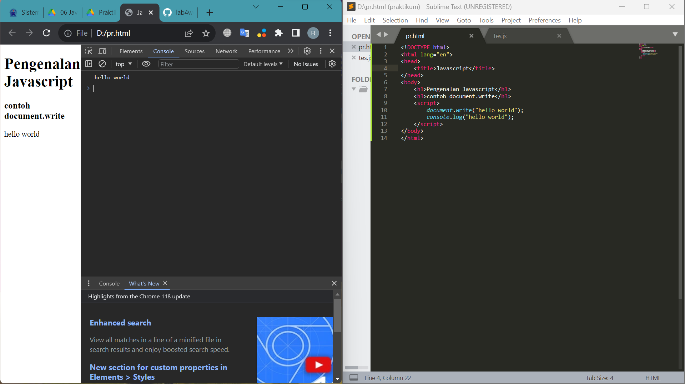

# Praktikum 5
```
Raja Heppyanto TI.22.A2
```
### Daftar Isi
1. Tugas dan pertanyaan
2. Practice praktikum
3. Validasi code Html


## 1. Tugas Dan pertanyaan 

1. Buat script untuk melakukan validasi pada isian form.
```

code and output
```


## 2. Practice praktikum

1. console log dan document write



2. Alret box


3. Penggunaal Method Dalam object


4. Pemakaian promt


5. Fungsi dan memanggilnya


6. Operasi aritmetika


7. Pengkondisian if-else


8. Penggunaan Operator switch Untuk seleksi kondisi


9. form input


10. Form button


11. Dom Menggunaka Chech Box


## 3. Validasi Code html